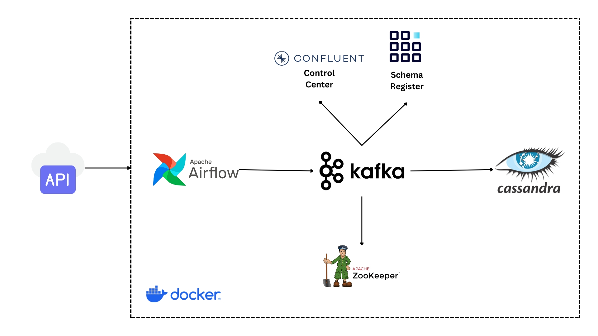

# Real-Time Data Streaming with Apache Kafka, Cassandra, and Airflow

## Project Overview

This project demonstrates a robust real-time data streaming pipeline using Apache Kafka, Cassandra, and Apache Airflow. It leverages Kafka for efficient data ingestion, utilizes Cassandra as a resilient NoSQL storage solution, and employs Airflow for orchestrating the entire data processing workflow. The system fetches user data dynamically from an external API and processes it through Kafka before persisting it in Cassandra. This solution is tailored to demonstrate the capabilities of handling high-volume, real-time data across distributed systems.

## Architecture

The architecture is designed to be scalable and fault-tolerant, incorporating the following key components:
- **Apache Kafka**: Serves as the backbone for real-time message streaming, efficiently handling incoming data streams.
- **Apache Cassandra**: Provides a highly available storage layer capable of managing large volumes of data.
- **Apache Airflow**: Acts as the workflow orchestrator, managing task scheduling, execution, and choreography.
- **Docker**: All components are containerized using Docker, ensuring consistent environments and simplifying deployment and scaling.
- **External API**: The system interfaces with an external API to fetch real-time user data, demonstrating the pipeline's ability to integrate with external data sources.
- **Zookeeper**: Essential for Kafka cluster coordination, maintaining configuration information and providing distributed synchronization.
- **Schema Registry**: Facilitates the management of Kafka data schemas, ensuring data consistency across the system.
- **Control Center**: Offers a comprehensive monitoring interface for Kafka, providing insights into cluster health, throughput, and performance.



## Usage

Once deployed, the pipeline operates autonomously, with components orchestrated to ensure continuous data processing and storage:
- **Data Ingestion**: Data is pulled periodically from the specified API and fed into Kafka.
- **Data Processing and Storage**: Airflow tasks process the data and store it in Cassandra for persistence.
- **Monitoring**: The entire flow can be monitored via Airflow’s web interface and Kafka’s Control Center.

### Accessing Kafka Control Center

To monitor Kafka operations, visit the Control Center at:
```
http://localhost:9021
```

This interface provides a real-time overview of Kafka topics, consumer groups, and overall cluster health.

### Accessing Airflow Web Interface

To monitor and manage the data processing workflows, access the Airflow web interface by navigating to:
```
http://localhost:8080
```

### Cassandra Database Access

To interact with the Cassandra database directly from the Docker environment, use the following command:
```bash
docker exec -it cassandra cqlsh
```
